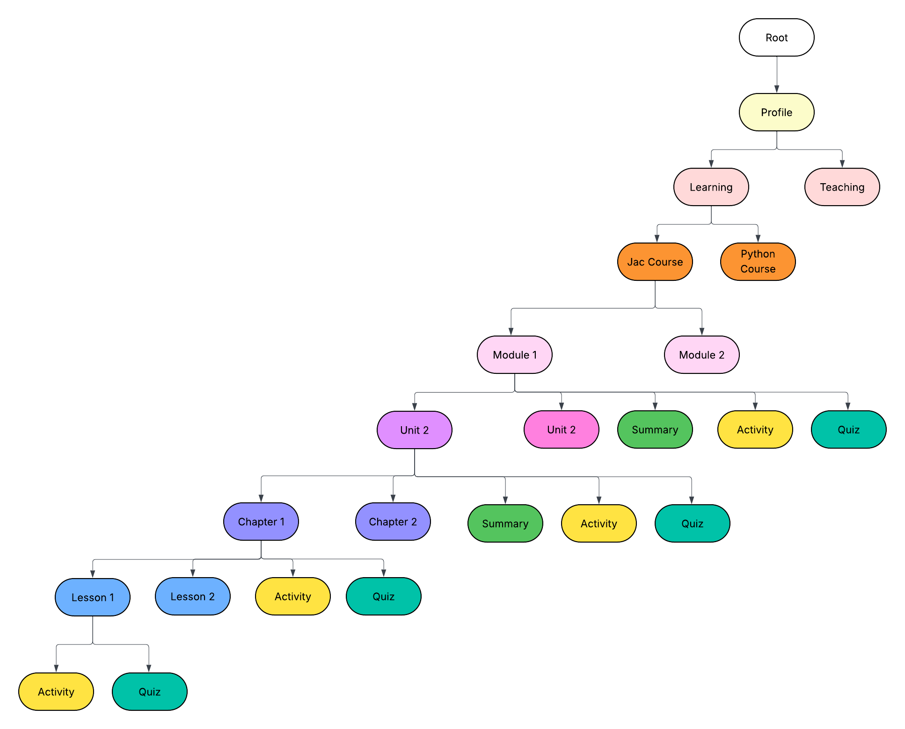

# 🎓 Jaclang Learn
### Interactive Programming Learning Platform
<!-- 
[](https://choosealicense.com/licenses/mit/)
[](https://github.com/yourusername/jacademy)
[](http://makeapullrequests.com)
[](CONTRIBUTING.md)

> An open-source interactive learning platform inspired by Sololearn, designed to teach programming languages starting with **Jaclang** and **Jaseci Stack** through gamified lessons, real-time coding challenges, and community-driven content.
<!-- 
## 📖 Table of Contents

- [✨ Features](#-features)
- [🏗️ Architecture](#️-architecture)
- [🚀 Quick Start](#-quick-start)
- [🛠️ Tech Stack](#️-tech-stack)
- [📚 Course Structure](#-course-structure)
- [🎮 Gamification](#-gamification)
- [🤝 Contributing](#-contributing)
- [📷 Screenshots](#-screenshots)
- [📄 License](#-license)
- [🙏 Credits](#-credits)
- [📧 Contact](#-contact) -->

<!-- ## ✨ Features

### 🎯 Core Learning Features
- **Interactive Code Playground** - Write, run, and test Jaclang and Python code in real-time
- **Structured Learning Path** - Progressive curriculum from basics to advanced concepts
- **Auto-Graded Assessments** - Instant feedback on coding exercises and quizzes
- **Multi-Language Support** - Starting with Jaclang and Python, expandable to more languages

### 🎮 Gamification & Engagement
- **Points & XP System** - Earn experience points for completing lessons and challenges
- **Achievement Badges** - Unlock badges for milestones and special accomplishments
- **Progress Tracking** - Visual progress indicators and learning analytics
- **Leaderboards** - Compete with other learners in coding challenges

### 👥 Community Features
- **Q&A Forums** - Ask questions and help fellow learners
- **Discussion Boards** - Engage in programming discussions
- **User-Generated Challenges** - Create and share custom coding problems
- **Peer Code Reviews** - Learn from community feedback

### 🔧 Developer Features
- **Modular Architecture** - Easy to extend with new courses and languages
- **Template System** - Standardized content creation templates
- **Admin Dashboard** - Manage courses, users, and content
- **API-First Design** - RESTful APIs for all platform functionality  -->

## 🏗️ Architecture

Our platform follows a hierarchical learning structure designed for optimal knowledge progression:



```
Course (e.g., "Jaclang Fundamentals")
├── Module 1 (e.g., "Getting Started")
│   ├── Unit 1 (e.g., "Introduction")
│   │   ├── Chapter 1 (e.g., "What is Jaclang?")
│   │   │   ├── Lesson 1: "History and Philosophy"
│   │   │   ├── Activity: "First Program"
│   │   │   ├── Quiz: "Basics Review"
│   │   │   └── Summary
│   │   └── Chapter 2...
│   └── Unit 2...
└── Module 2...
```

## 🚀 Quick Start

<!-- ### Prerequisites
- **Python 3.8+**
- **Node.js 16+**
- **Git**
- **Docker** (optional, for containerized deployment) -->

<!-- ### 1. Clone the Repository
```bash
git clone https://github.com/Thamirawaran/jacademy.git
cd jacademy
```

### 2. Backend Setup
```bash
# Navigate to backend directory
cd backend

# Create virtual environment
python -m venv venv
source venv/bin/activate  # On Windows: venv\Scripts\activate

# Install dependencies
pip install -r requirements.txt

# Run database migrations
python manage.py migrate

# Start the backend server
python manage.py runserver
```

### 3. Frontend Setup
```bash
# Navigate to frontend directory (in a new terminal)
cd frontend

# Install dependencies
npm install

# Start the development server
npm start
```

### 4. Access the Application
- **Frontend**: http://localhost:3000
- **Backend API**: http://localhost:8000
- **Admin Panel**: http://localhost:8000/admin -->
<!-- 
### Docker Quick Start (Alternative)
```bash
# Build and run with Docker Compose
docker-compose up --build

# Access at http://localhost:3000
``` -->

<!-- ## 🎮 Gamification -->
<!-- 
### Point System
- **Lesson Completion**: 10 XP
- **Quiz Perfect Score**: 25 XP
- **Coding Challenge**: 50 XP
- **Daily Streak**: 5 XP bonus
- **Helping Others**: 15 XP

### Achievement Badges
- 🥇 **First Steps** - Complete your first lesson
- 🔥 **Streak Master** - 7-day learning streak
- 🧠 **Quiz Champion** - Score 100% on 10 quizzes
- 💻 **Code Ninja** - Complete 50 coding challenges
- 🤝 **Community Helper** - Help 25 fellow learners

## 🤝 Contributing

We welcome contributions from developers of all skill levels! Here's how you can help:

### 🐛 Reporting Bugs
1. Check existing [issues](https://github.com/yourusername/jacademy/issues)
2. Create a new issue with detailed description
3. Include steps to reproduce and expected behavior

### 💡 Suggesting Features
1. Open a [feature request](https://github.com/yourusername/jacademy/issues/new)
2. Describe the feature and its benefits
3. Discuss implementation approaches

### 🔧 Code Contributions
1. **Fork** the repository
2. **Create** a feature branch (`git checkout -b feature/amazing-feature`)
3. **Commit** your changes (`git commit -m 'Add amazing feature'`)
4. **Push** to the branch (`git push origin feature/amazing-feature`)
5. **Open** a Pull Request

### 📝 Content Contributions
- Create new lessons and courses
- Improve existing content
- Add coding challenges
- Review and test educational materials

### Development Guidelines
- Follow [Jaclang Documentation](https://www.jac-lang.org/) for Jac code

## 📄 License

This project is licensed under the MIT License - see the [LICENSE](LICENSE) file for details.

```
MIT License

Copyright (c) 2025 Jaclang Learn Contributors

Permission is hereby granted, free of charge, to any person obtaining a copy
of this software and associated documentation files (the "Software"), to deal
in the Software without restriction, including without limitation the rights
to use, copy, modify, merge, publish, distribute, sublicense, and/or sell
copies of the Software, and to permit persons to whom the Software is
furnished to do so, subject to the following conditions:

The above copyright notice and this permission notice shall be included in all
copies or substantial portions of the Software.
``` -->

<!-- ## 🙏 Credits -->

<!-- ### Created By
- **Thamirawaran** - *Lead Developer* - [@Thamirawaran](https://github.com/Thamirawaran) -->

### Inspiration
- **Sololearn** - For pioneering mobile-first programming education
- **FreeCodeCamp** - For open-source educational excellence
- **Codecademy** - For interactive learning methodology

<!-- ### Special Thanks
- Jaclang Community for language support
- Open Source Contributors
- Beta testers and early adopters

### Technologies
- Built with ❤️ using modern web technologies
- Powered by the amazing open-source community -->

<!-- ## 📧 Contact

- **Project Website**: [https://jacademy.dev](https://jacademy.dev)
- **Documentation**: [https://docs.jacademy.dev](https://docs.jacademy.dev)
- **Issues & Support**: [GitHub Issues](https://github.com/yourusername/jacademy/issues)
- **Community Discord**: [Join our Discord](https://discord.gg/jacademy)
- **Email**: contact@jacademy.dev -->

---

<!-- <div align="center">

**[⬆ Back to Top](#-jaclang-learn)**

Made with 💻 and ☕ by the Jaclang Learn team

</div> -->
